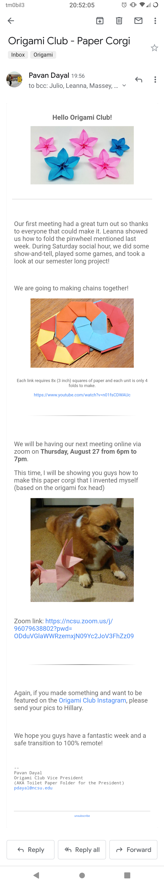

# html-email
beautiful html emails (from being origami club vp)

## Notes:
 * html emails must either have images that are http links or are put in
 directly in the source.
 * if you have an image i.e. `image.png` you can put it in the source with
 the following template:   
 ``   
 where you replace `aaaaaaaaa...a` with the base64 string for the file   
 this can be found with `base64 image.png | sed -z "s/\n//g" > image.txt`

## Screenshot:

